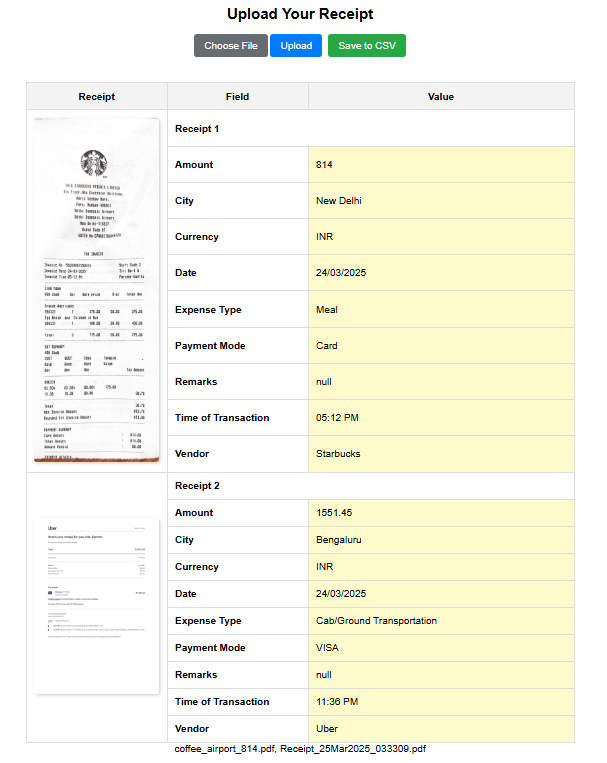

# expenSieve: LLM-based Receipt Processing Web App
This is a Flask-based web application that allows users to upload multiple receipt images (or PDFs), extract structured expense data using OpenAI's GPT-4o Vision model, and save the parsed information to a CSV file. The application is designed to be mobile-friendly and supports multiple file uploads at once.


## Overview
This web application allows users to upload multiple receipts (images or PDFs), extract structured expense data using OpenAI's GPT-4o Vision model, and save the processed transactions to a CSV file. The app is built with Flask for the backend and JavaScript for the frontend.

## Features
- Upload multiple receipts (JPG, PNG, or PDF format)
- Process receipts using OpenAI's GPT-4o for structured data extraction
- Display extracted data in an editable table
- Preview receipt thumbnails in the table
- Save expense data to a CSV file
- Mobile-friendly UI

## Installation
### Prerequisites
- Python 3.8+
- Flask
- OpenAI API Key (if using GPT-4o for processing)
- Node.js (optional, for frontend enhancements)

### Setup
1. Clone the repository:
   ```bash
   git clone https://github.com/your-username/expense-receipt-processor.git
   cd expense-receipt-processor
   ```
2. Install dependencies:
   ```bash
   pip install -r requirements.txt
   ```
3. Set up environment variables:
   Create a `.env` file and add your OpenAI API key:
   ```
   OPENAI_API_KEY=your_api_key_here
   ```
4. Run the Flask app:
   ```bash
   python app.py
   ```
5. Open the web app in a browser:
   ```
   http://127.0.0.1:5000
   ```

## Usage
1. Select and upload one or multiple receipt images/PDFs.
2. View extracted structured data in the table.
3. Edit any incorrect values directly in the table.
4. Click **Save** to store the transactions in the CSV file.

## File Structure
```
expense-receipt-processor/
¦-- static/
¦   +-- uploads/         # Stores uploaded files
¦   +-- processed/       # Stores processed images
¦-- templates/
¦   +-- index.html       # Frontend UI
¦-- app.py               # Flask backend
¦-- requirements.txt     # Python dependencies
¦-- .env                 # Environment variables
¦-- README.md            # This file
```

## API Endpoints
### `POST /upload`
- **Input**: Multipart form with one or more receipt files
- **Output**: JSON with extracted receipt data and image preview URLs

### `POST /save`
- **Input**: JSON with edited expense details
- **Output**: Confirmation message & updated spreadsheet data

## Future Enhancements
- Automatic email parsing for receipts
- Multi-page PDF handling
- Cloud storage integration (OneDrive/Google Drive)

## Author
Sammit Jain

